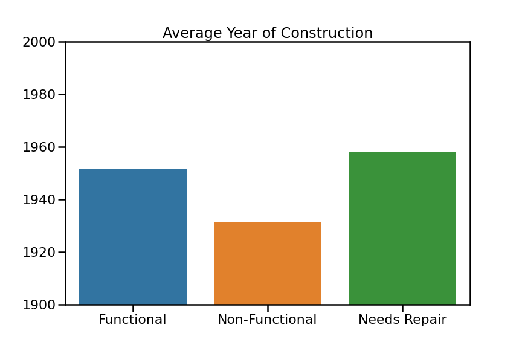

# Predicting Tanzanian Well Status

## Overview
Water scarcity is one of the most pressing global issues, and it becomes more pressing of an issue every year. Every day, approximately 5000 children die due to lack of access to sanitary drinking water. Tanzania, like many countries in Africa, suffers from extreme water scarcity. One of the best measures to provide safe water to individuals in these unindustrialized nations is installing water wells. However, nearly half of all wells in Tanzania are non-functional. I created a model that is able to predict the functioning of a well with 81% accuracy based on 17 different variables. Being able to predict which wells are at high-risk of being faulty has several possible utilazations to help provide access to safe water in Tanzania.

## Business Understanding
As mentioned above, Tanzania suffers from extreme water scarcity, but it is uniquely poised to respond to insights provided by the model I made. The Tanzanian market for water supply and sanitation technology is particularly dynamic. Tanzania's responsiveness to innovation has been displayed by growing markets in water storage tanks, rain harvesting facilities, and increased plumbing in Urban areas. Furthermore, Tanzania has a growing digital financial sector democratizing access to these technologies. Microloans from industrialized nations can be used in tandem with Tanzanian banks to provide the capital needed to improve maintenance and utilization of these emerging technologies.

## Data Understanding
The data used to create this model was collected by the Tanzanian Ministry of Water and aggregated by the open source platform Taarifa, that collects, agrregates, and analyzes many different types of global infrastructure data.

## Modeling & Evaluation
I tested four different models to finally create a model that could predict the functional status of a Tanzanian water well with 81% accuracy. Given the baseline model accuracy of 55%, the model displayed a considerable predictive power. One problem with the model is it struggled accurately identifying wells that are functional, but in need of repair. There were several features that did the best job in determining the status of the well. For example, non-functional wells were considerably older than wells that were still functional. Another insight from the model is that elevation effects the functionality of a well. Somewhat counterintuitively, the higher the elevation, the more likely the well is functional.

## Conclusion
Given the high accuracy of the final model, it should provide useful insights on wells whose features suggest that they are at high-risk of breaking or going dry. Focusing maintanence and prophylactic resources towards these high-risk wells should help ameliorate water scarcity in communities that rely on them. Furthermore this model can be used to identify environments that are more resilient to well deterioration, and build wells that will hopefully induce migration to these areas. If this model was provided to the Tanzanian Government, they should be able to provide unique insights that could improve this model and fully utilize all its implications. With this mode we should be able to improve not only Tanzanian child welfare, but the welfare of all its citizens.
